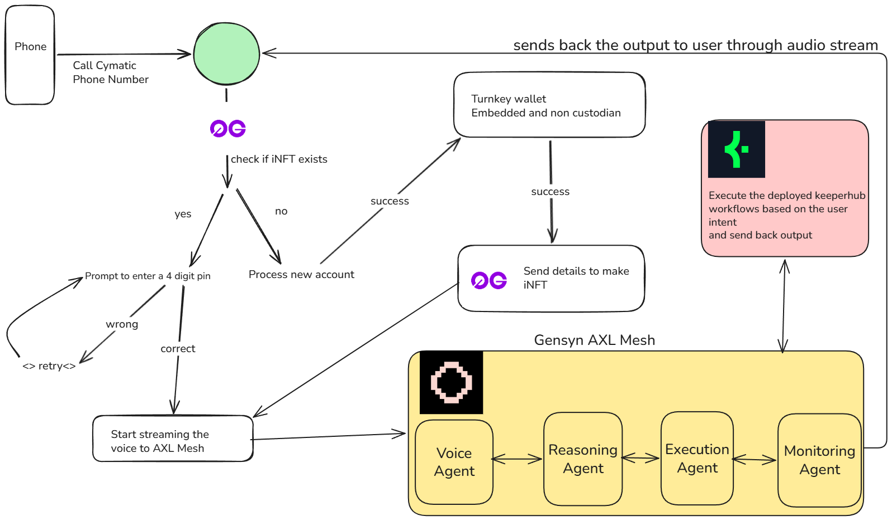

# Cymatic

Cymatic is a voice first AI agent system that lets users interact with onchain capabilities through a normal phone call.

The core goal is simple:
- no app install
- no wallet extension
- no internet requirement on the user side
- a natural call based experience that still executes real Web3 actions

## What Is Cymatic

Cymatic turns a phone number into a personalized AI interface.

When a user calls:
1. the system identifies the user by phone number
2. creates or retrieves a wallet linked profile
3. routes intent to the right agent capabilities
4. executes actions through secure workflow infrastructure
5. keeps identity and agent personalization tied to that caller profile

This makes Cymatic practical for real world users who may not use browser wallets or traditional dApp UX.

## What We Used And Why

### 1) Gensyn AXL

We used Gensyn AXL as the agent communication layer.

Why we used it:
- It provides agent to agent transport so capabilities can be separated into focused services.
- It helps us keep a modular architecture where voice handling, reasoning, and execution can evolve independently.
- It is better for long term scaling than packing everything into one monolith.

What it enables in Cymatic:
- clean message flow between specialized components
- easier observability and debugging of agent interactions
- extensibility for adding new agents later without reworking the whole system

### 2) KeeperHub Workflows

We used KeeperHub Workflows for action execution and workflow orchestration.

Why we used it:
- It gives us structured execution for real operations instead of ad hoc scripts.
- It is easier to audit and reason about than free form transaction logic.
- It reduces risk by enforcing predictable execution steps.

What it enables in Cymatic:
- reliable agent action execution
- operational consistency across calls
- practical path to production style automation and controls

### 3) 0G iNFT (ERC-7857 based Caller Identity)

We used 0G iNFT as the identity anchor for caller bound intelligence and personalization.

Why we used it:
- We needed an onchain identity primitive that maps well to voice users.
- iNFT gives a programmable identity object that can carry persistent agent context.
- It creates a verifiable identity layer for actions initiated by phone.

What it enables in Cymatic:
- caller linked identity continuity
- persistent personalization across sessions
- auditable onchain identity state tied to the product logic

## 0G iNFT Contract Details

Cymatic iNFT contract address:
- `0xFB61896B0521594B49f261c96bd0313Ce32D70E7`

0G explorer link for this contract transactions:
- https://explorer.0g.ai/testnet/blockchain/accounts/0xfb61896b0521594b49f261c96bd0313ce32d70e7/transactions

### Identity Personalization Note

Cymatic already has multiple phone number associated accounts created against this iNFT driven identity flow. Each caller can have personalized agent behavior and context based on their linked phone profile and associated identity state.

## Setup Instructions

## 1) Prerequisites

- Node.js 20+
- Python 3.13+
- npm
- pip/venv (or uv if preferred)

## 2) Clone Repository

```bash
git clone <your-repo-url>
cd Cymatic
```

## 3) Backend Setup

```bash
cd backend
python -m venv ../.venv
source ../.venv/bin/activate
pip install -e .
```

Create and fill `backend/.env` from `backend/.env.example`.

Minimum expected variables include:
- `SUPABASE_URL`
- `SUPABASE_SECRET_KEY`
- `TURNKEY_API_PUBLIC_KEY`
- `TURNKEY_API_PRIVATE_KEY`
- `TURNKEY_ORG_ID`
- `TWILIO_ACCOUNT_SID`
- `TWILIO_AUTH_TOKEN`
- `TWILIO_PHONE_NUMBER`
- `BASE_URL`

Run backend:

```bash
cd backend
/home/harsh/repos/Cymatic/.venv/bin/python -m uvicorn main:app --app-dir /home/harsh/repos/Cymatic/backend --host 127.0.0.1 --port 8000
```

## 4) Frontend Setup

```bash
cd frontend
npm install
npm run dev
```

Frontend will run on:
- `http://localhost:3000` (or next available port)

## 5) Smart Contract / 0G Notes

- Caller iNFT contract is deployed at the address above.
- The landing page includes a direct button to this 0G explorer contract transactions page.
- Identity behavior is caller centric, where multiple phone number linked accounts can map to personalized agent handling.

## Architecture Diagram



## Team

- Harsh Suthar
  - Telegram: [@harshsuthar_2](https://t.me/harshsuthar_2)
  - Twitter: [@1_fudou](https://x.com/1_fudou)
- Abhinav Vardhar
  - Telegram: [@dabhinav22](https://t.me/dabhinav22)
  - Twitter: [@Abhinav_2203](https://x.com/Abhinav_2203)